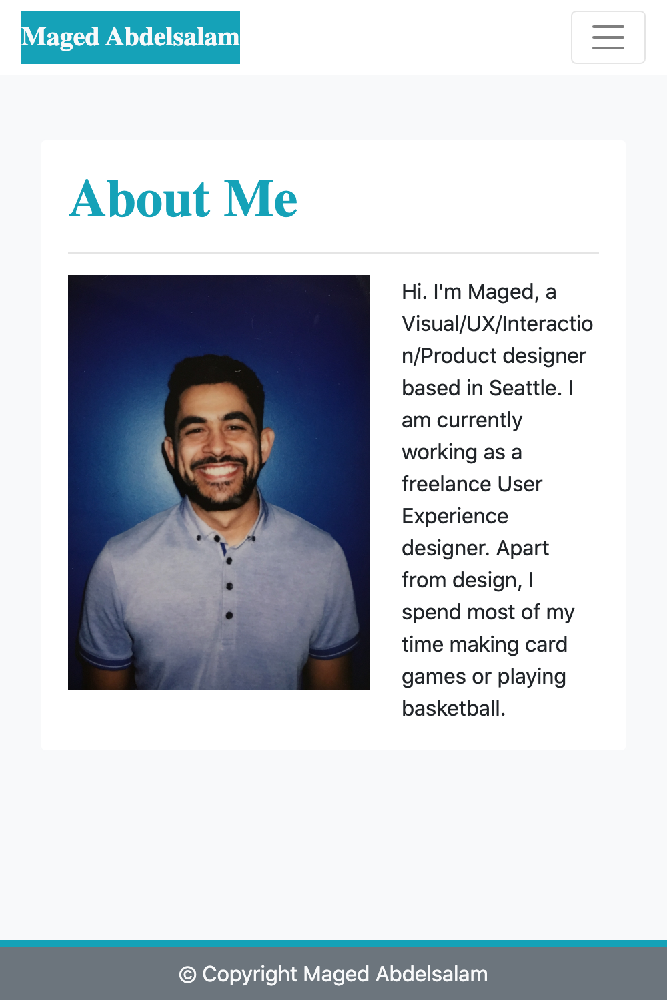
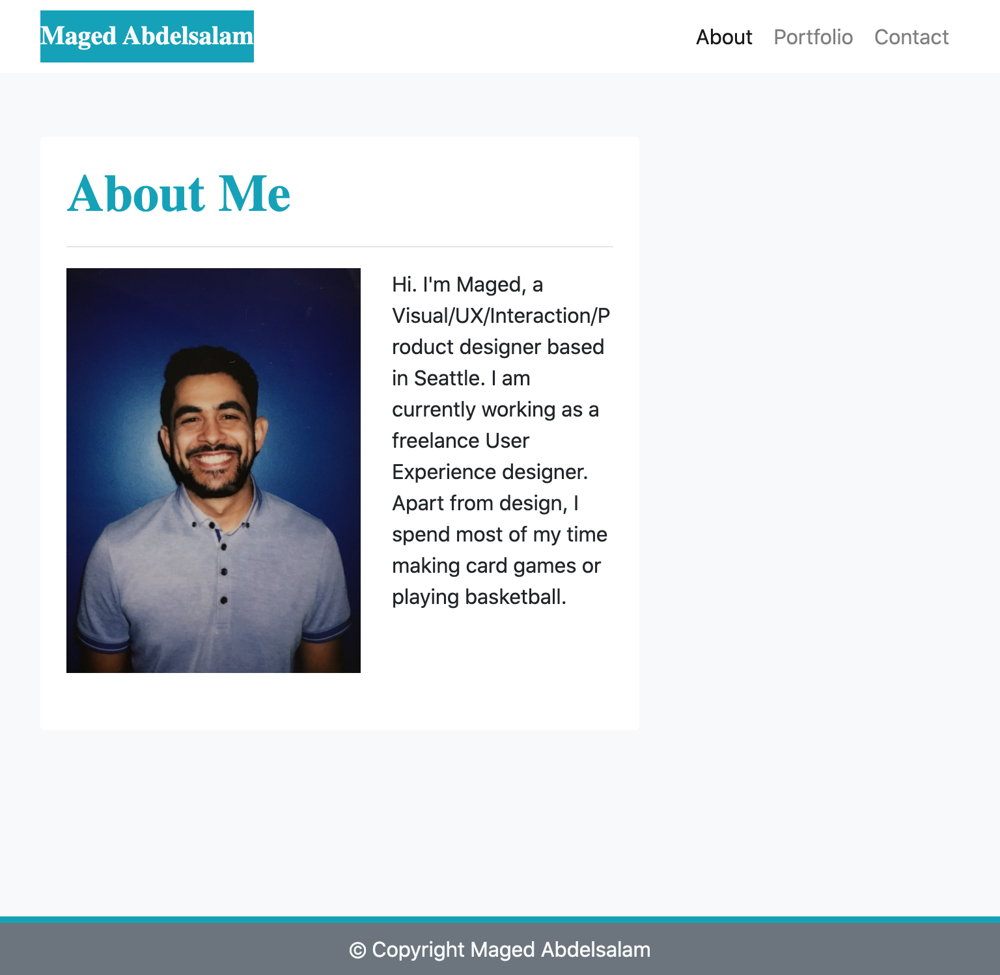
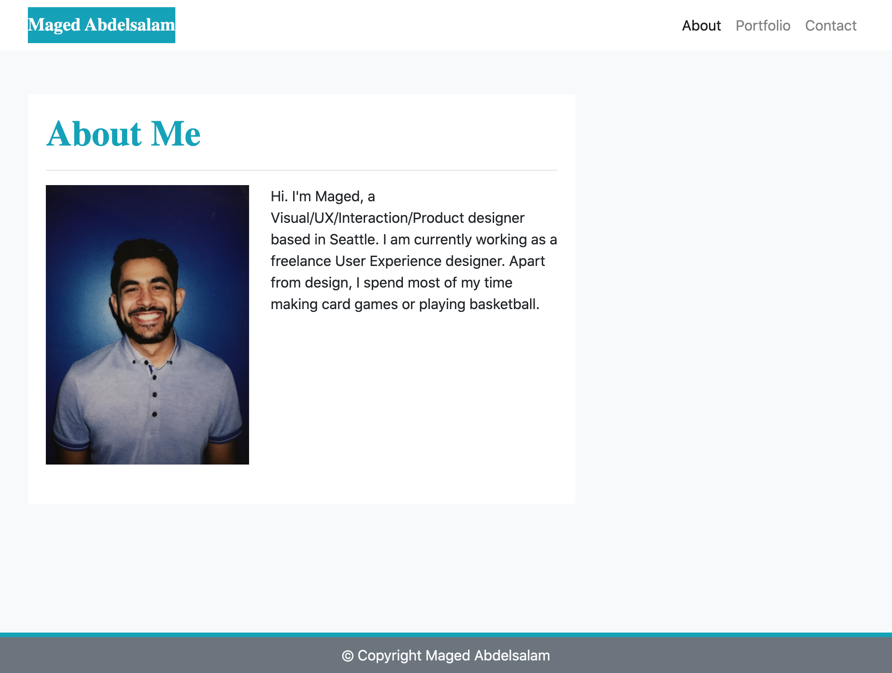
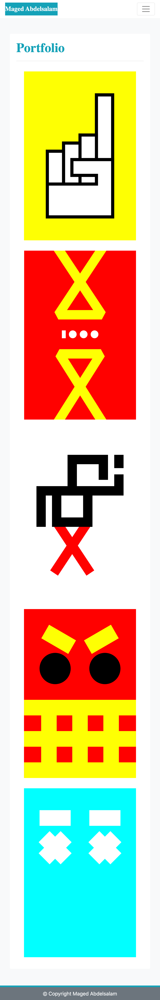
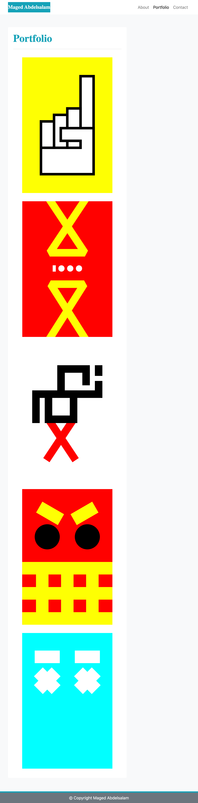
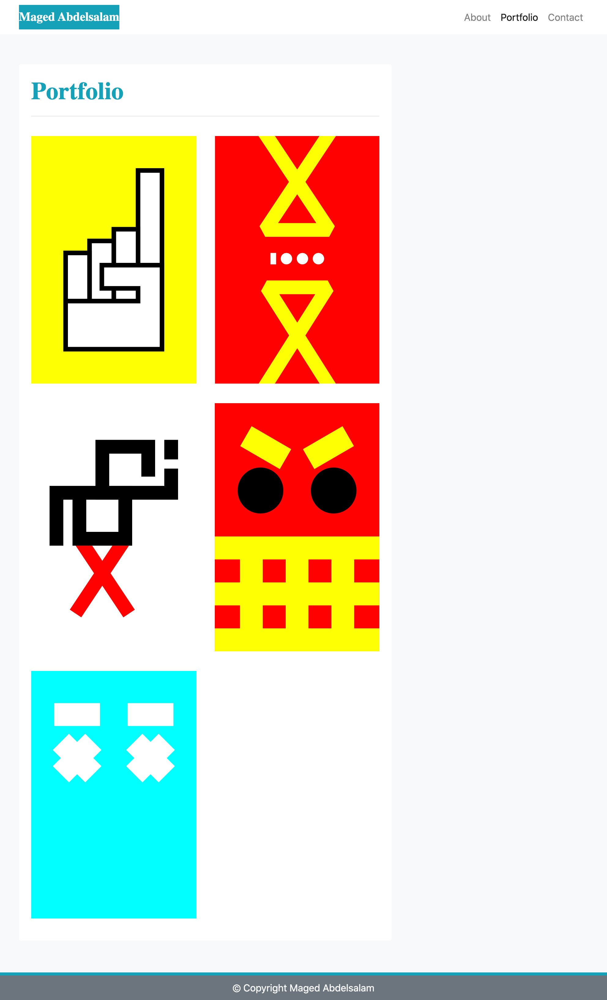
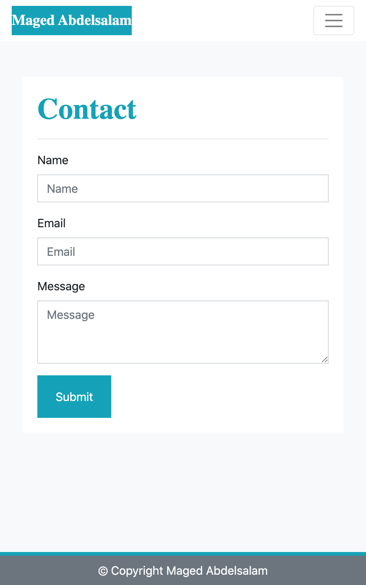
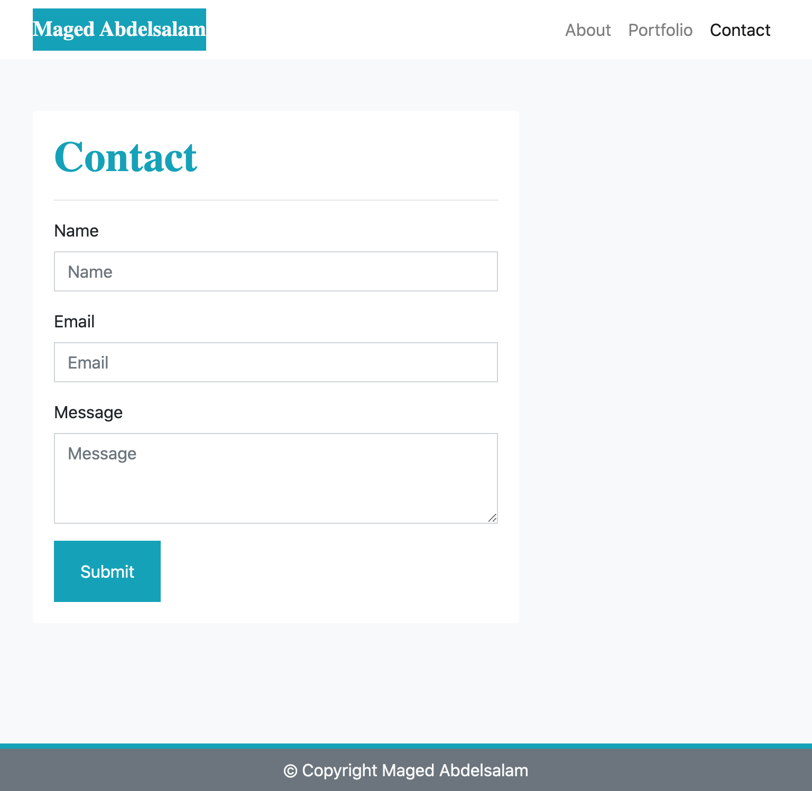
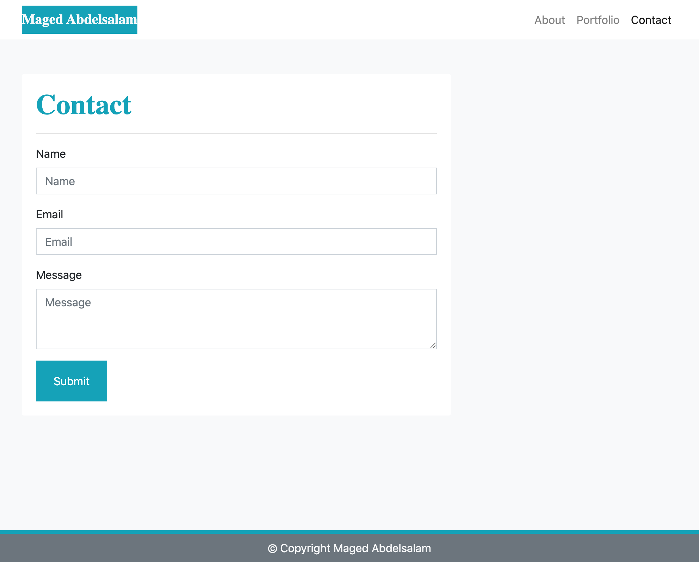

# 02 Responsive Portfolio

## Description

Using bootstrap, I made a mobile responsive portfolio website to showcase my bio, contact info, and some posters I designed back in 2011.

## Links

* [Github repository](https://github.com/magedabdelsalam/responsive-portfolio)
* [About page](https://magedabdelsalam.com/responsive-portfolio/index.html)
* [Portfolio page](https://magedabdelsalam.com/responsive-portfolio/portfolio.html)
* [Contact page](https://magedabdelsalam.com/responsive-portfolio/contact.html)

## Preview

### About screenshots

### Portfolio screenshots

### Contact screenshots

